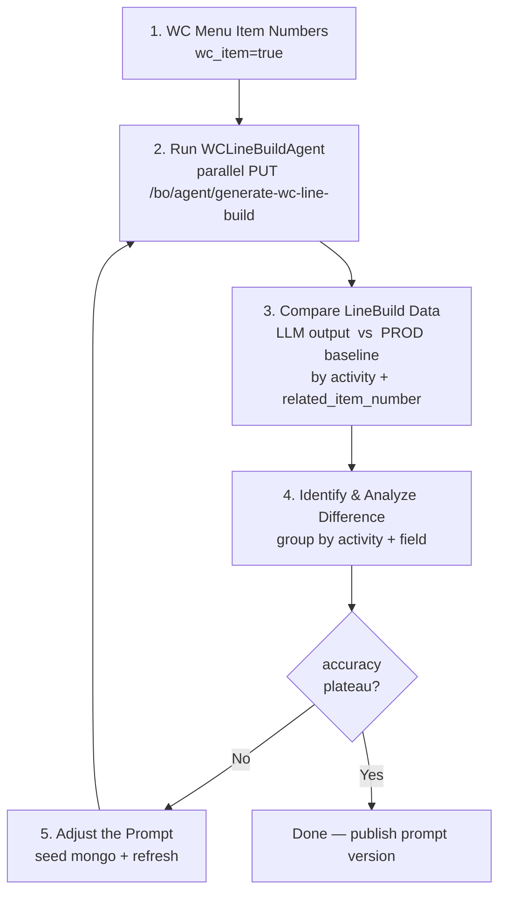

# WC Line Build Agent Prompt Tuner

End-to-end loop: **read prod baseline → call local API → compare → adjust prompt → reseed → re-run** until LLM output matches prod line build config.

## Hard rules (read first)

1. **prod (`mongodb-prod_*`) is READ-ONLY**. Never call any prod write tool (`insert/update/delete/aggregate-with-out`). All writes go to `mongodb-local_*` only.
2. **Local agent collections live in `mongodb-local` db = `recipe-agent`**; prod menu data lives in `mongodb-prod` db = `recipe-v2`.
3. **Each HTTP request needs a unique `chat_session_id`** (use `uuid.uuid4().hex[:12]` per call). Reusing one ID makes ADK reuse session memory → wrong test.
4. **The three target brands**: `Royal Greens` / `Limesalt` / `Yasas by Michael Symon`. Only menu items whose `brand_names` intersect with these are valid inputs.
5. **Prompt `_id`** in `recipe-agent.agent_instruction_configs` is `7b4f1c9a-1d8e-4f2a-9c3b-5e6f7a8b9c0d` (`instruction_name = LINE_BUILD_FILLER`).
6. Refresh after each prompt update: `curl -sk -X PUT https://127.0.0.1:5097/bo/agent/refresh`. If service has prompt cache issues, ask user to restart instead.

## Trust-source-first mindset (核心原则)

**Prod is the source of truth.** Whenever LLM output differs from prod's line-build configuration, **do NOT immediately patch the prompt to make the LLM "win" the comparison**. Instead:

1. **Re-think prod's underlying rule** — why is prod configured the way it is? What business / kitchen-operation reason explains this value? (e.g. "Limesalt salad parking is AMBIENT because salads are cold-served"; "Quesadilla uses TURBO_OVEN not PRESS because the dish needs the cheese melted, not pressed flat".)
2. **Form a hypothesis** about the rule (per-brand default? per-dish-type override? menu-name keyword trigger? a specific itemNumber's appliance preference?).
3. **Verify the hypothesis by querying prod data rigorously** — use `mongodb-prod_aggregate` to slice `item_versions` by brand / dish-category / itemNumber / activity and confirm the pattern statistically (e.g. "92% of Limesalt salads use `(15, 1800, AMBIENT)`; the remaining 8% are all `Quesadilla`"). Quote sample sizes.
4. **Only then encode the verified rule in the prompt.** Add a comment in the prompt explaining the prod-side evidence (e.g. "Limesalt Quesadilla family → `(1200, WARM)` — confirmed across 8/9 prod menus") so future maintainers can re-verify.
5. **Stay honest about the limits**: when a difference is genuine prod variance (different chefs, A/B test, restaurant-specific) or a known skeleton issue (wrong `related_item_number`), say so explicitly and **don't bend the prompt to chase noise**.

This discipline keeps the prompt aligned with reality, prevents over-fitting to the test set, and makes every rule traceable back to prod evidence.

## Standard loop (one iteration)



Per-step notes:

1. **WC Menu Item Numbers** — query `recipe-agent.item_version_line_build_cook_methods` for `wc_item=true` menu numbers, then map to effective `item_version_id` via prod `recipe-v2.item_versions`.

   **Test-set filtering (recommended)**: prefer menus whose **`item_customization` is null or empty** (`item_customization == null` OR `item_customization.options` array is empty). BYO / customizable dishes (e.g. `Bowl (BYO), Limesalt`) carry multiple line_build variants per restaurant / option and their COMPLETE/COOK configs drift across variants — they are the dominant source of statistical noise in the comparison phase. Filtering them out shrinks the test set (e.g. 68 → 31 menus) and gives a cleaner per-field accuracy signal on the canonical line build.

   When iterating on RULE 2 (`hold_usage_seconds` / `parking_spot`) or RULE 3 (COOK tuple selection), the no-customization subset is the right test set; only after those rules plateau should you re-add BYO menus to validate that the prompt doesn't regress on the complex shapes.

   Example aggregation (prod read-only):
   ```
   db.item_versions.aggregate([
     { $match: { _id: { $in: [...effective ivids...] } } },
     { $project: {
         name: 1, item_number: 1,
         has_customization: {
           $cond: [
             { $or: [
                 { $eq: ["$item_customization", null] },
                 { $eq: [ { $ifNull: ["$item_customization.options", []] }, [] ] }
             ] },
             false, true
           ]
         }
     } },
     { $match: { has_customization: false } }
   ])
   ```

2. **Run WCLineBuildAgent** — `scripts/runner_parallel.py` fires concurrent requests (unique `chat_session_id` per call), polls `generate_wc_line_build_logs` for completion, dumps to `llm-output.json`. The dump includes both `llm_response_json` (model output) AND `skeleton_json` (backend-built input). Both are needed for accurate comparison — see "Comparison semantics" below.
3. **Compare** — two ways, identical math:
   - `scripts/compare.py` → stdout summary + `mismatches.json` (per-field severe/light mismatches, 参考 rows excluded).
   - `scripts/excel_report.py` → 7-sheet `report.xlsx` (Summary / Per-Item / Details / Mismatches / LLM-Unmatched / Prod-NotMatched / LineBuilds) for human review and longitudinal comparison across prompt versions.
4. **Identify & Analyze** — open `report.xlsx` → `Mismatches` sheet, group by `(activity, field)`; classify as prompt issue / skeleton issue / prod outlier. Use `Details` sheet's 参考 (gray) rows when investigating packaging-naming questions.
5. **Adjust the Prompt** — edit **`backend/master-data-agent-service/src/main/resources/wc-line-build-agent-prompt.md`** (and the `.zh.md` mirror for human review). `scripts/seed_prompt.py` writes it back to mongo and `curl PUT /bo/agent/refresh` reloads the agent. Path moved here from `openspec/` so the prompt lives next to the Java service that consumes it.

Salad-heavy traffic: this endpoint's live requests are dominated by salad menus. Always sanity-check `BYO Greens Bowl, Royal Greens` + `Salad (BYO), Limesalt` + Yasas spreads before declaring a prompt version stable.

## Comparison semantics (read before changing scripts)

These rules are baked into `scripts/excel_report.py` (and inherited by `compare.py`). Violating them produces false-positive mismatches that mislead prompt tuning.

### 1. LLM never returns `procedure_steps[].related_item_number` — it's null
The Gemini controlled-generation schema (`LineBuildFillResultSchema.java`) does not require the model to fill `related_item_number` on steps. So in `llm_response_json` every step has `related_item_number: null`. Don't intersect LLM rels with prod rels — the result is always empty.

### 2. Skeleton has the rel; enrich LLM with it before comparing
`generate_wc_line_build_logs.skeleton_json.line_builds[].tasks[].procedures[].procedure_steps[].related_item_number` is populated by `WCLineBuildBuilder.java` from `item_version_line_build_cook_methods` (which mirrors prod menu data). Skeleton and LLM share the same procedure layout (1:1 by `order` index), so you can transplant rels into LLM in-place. `excel_report.build_data()` does this automatically via `enrich_llm_with_skeleton()`.

### 3. Pairing is rel-first, positional-fallback — at BOTH procedure level and step level
**Procedure level (within an activity bucket):**
- Phase 1: LLM procs whose first step has a non-null rel are paired with the prod proc carrying the same rel.
- Phase 2: leftovers on both sides are paired by order index.
- Unpaired LLM procs land in `LLM-Unmatched`; unpaired prod procs land in `Prod-NotMatched`.

**Step level (within a paired procedure):**
- Phase 1: rel-based.
- Phase 2: positional fallback.
- Steps prod has but LLM dropped → `step_title[N] (LLM missing this step)`.
- Steps LLM hallucinated extra → `step_title[+N] (LLM extra step)` (typical example: LLM emits 3× `Place in Bag` when prod has 1).

Without step-level rel pairing you get classic false positives like:
```
COOK step_title[0]   prod='4oz Portion Cup'   llm='Queso Blanco'
```
The LLM didn't get it wrong — it just dropped the packaging step. With rel-pairing the actually-correct `Queso Blanco vs Queso Blanco` match wins, and the missing step surfaces as `step_title[0] (LLM missing this step)` instead.

### 4. Four verdict tiers
| Verdict | Counted in stats? | Meaning |
|---|---|---|
| `match` | yes | llm == prod |
| `严重预警` | yes | Functional field off: `hold_usage_seconds`, `parking_spot`, `appliance`, `cooking_usage_seconds`, `batch_limit`, `appliance_config_id` |
| `轻量预警` | yes | Cosmetic / minor: `step_usage_seconds`, or `step_title` where both sides have a rel |
| `参考` (reference) | **no** — excluded from numerator and denominator | COOK/GARNISH `step_title` where one side has no rel. These are usually packaging/sleeve naming drift (`16oz Black Cup` vs `16oz Deli Container, Limesalt Sleeve`) — operations allows variance. Shown gray in Details for inspection. COMPLETE keeps full comparison because the `Place in Bag` regression must surface. |

### 5. `shared_related_item_numbers` column shows PROD's rel(s), not the intersection
After enrichment LLM and prod rels for paired procs should match. Displaying prod's rels lets you reverse-lookup "this mismatch is anchored to menu item 9000727 / ingredient 4000550" — directly actionable. When prod's proc has no rel at all (e.g. pure-text COMPLETE like Chocolate Pudding "Place in Large Bag"), shows `(placeholder)`.

## Quick Usage

All scripts read/write a single output directory. By default that's `./prompt-tuner-out/`
relative to wherever you run python from; override with the `PROMPT_TUNER_OUT_DIR`
environment variable for any other layout.

```bash
# Pick your output directory (one-time, optional)
export PROMPT_TUNER_OUT_DIR=/path/to/your/workspace/tuner-out
```

The skill assumes the agent service is running locally at
`https://127.0.0.1:5097` with MongoDB at `mongodb://localhost:27017`. Adjust the
constants at the top of each script if your setup differs.

### Pull baseline

```bash
# 1. Pull the wc_item=true menu list from your local mongo (one-off setup helper):
python -c "from pymongo import MongoClient; \
  c = MongoClient('mongodb://localhost:27017')['recipe-agent']['item_version_line_build_cook_methods']; \
  ids = sorted({m['menu_item_number'] for r in c.find({}) for m in r['methods'] if m.get('wc_item')}); \
  import json, os; \
  os.makedirs(os.environ.get('PROMPT_TUNER_OUT_DIR', 'prompt-tuner-out'), exist_ok=True); \
  open(os.path.join(os.environ.get('PROMPT_TUNER_OUT_DIR', 'prompt-tuner-out'), 'wc_item_numbers.json'), 'w').write(json.dumps(ids))"

# 2. Resolve menu_item_numbers → effective item_version_ids via prod (read-only).
#    Use mongodb-prod_aggregate to filter effective=true and item_customization=null,
#    save the resulting list of _id strings as <out>/ivids.json.
#    Aggregation pipeline:
#      $match: { item_number: { $in: [...wc_item_numbers...] }, effective: true }
#      $project: { _id: 1, has_customization: $cond[item_customization.options not empty] }
#      $match: { has_customization: false }   # optional, for the cleanest test set

# 3a. Pull the baseline from prod via pymongo (needs PROD_MONGO_URI set):
python scripts/pull_baseline.py --ivids "$PROMPT_TUNER_OUT_DIR/ivids.json" --prod-uri "$PROD_MONGO_URI"

# 3b. ALTERNATIVE — use the mongodb-prod_export MCP tool when you don't have PROD_MONGO_URI:
#     Call mongodb-prod_export with:
#       database=recipe-v2, collection=item_versions,
#       exportTarget=[{name:find, arguments:{filter:{_id:{$in:[...ivids...]}}, projection:{_id:1,item_number:1,name:1,item_line_build:1}}}]
#       jsonExportFormat="relaxed"   # IMPORTANT: relaxed, not canonical — canonical wraps ints as {$numberInt:"915"}
#     Then copy the exported file to <out>/baseline-raw.json and run the bundled compact builder:
#     python -c "import json,os; \
#       from scripts.pull_baseline import compact; \
#       out=os.environ['PROMPT_TUNER_OUT_DIR']; \
#       raw=json.load(open(out+'/baseline-raw.json','r',encoding='utf-8')); \
#       json.dump([compact(d) for d in raw], open(out+'/baseline.json','w',encoding='utf-8'), ensure_ascii=False, indent=2)"

# Both 3a and 3b produce: <out>/baseline-raw.json + <out>/baseline.json
```

**Test-set reality check** (run this query once to size your expectations):
of the ~68 menus tagged `wc_item=true`, typically only ~30-35 have a non-empty `item_line_build` in prod (a mix of ~29 no-customization menus + ~8 BYO menus). The remaining ~30+ are unconfigured prep/sauce/ingredient items — the LLM will still generate output for them but `compare.py` silently skips them because there's no prod baseline to compare against. Filter your `ivids.json` to items where `item_line_build.line_builds` is non-empty if you want the runner's wall-clock time to match the comparison surface.

### Seed prompt md → mongo + refresh

The prompt lives at **`backend/master-data-agent-service/src/main/resources/wc-line-build-agent-prompt.md`** in the consuming repo (English; `.zh.md` is the Chinese mirror — review only, do NOT seed it). Edit the English file, then seed:

```bash
python scripts/seed_prompt.py --prompt backend/master-data-agent-service/src/main/resources/wc-line-build-agent-prompt.md
curl -sk -X PUT https://127.0.0.1:5097/bo/agent/refresh
```

### Parallel run + compare

```bash
rm -f "$PROMPT_TUNER_OUT_DIR/llm-output.json"
python scripts/runner_parallel.py --workers 8

# Quick stdout summary (per-field accuracy + verdict totals):
python scripts/compare.py

# OR full 7-sheet xlsx report for human review / version comparison:
python scripts/excel_report.py \
  --prompt-version "v4.11 (2026-05-25)" \
  --out "$HOME/Desktop/line_build_agent/report_v4.11_nocust.xlsx"
```

Both compare.py and excel_report.py share the same matching engine (`excel_report.build_data()`),
so per-field percentages from stdout match the Summary sheet exactly.

Tip: keep one xlsx per prompt version (`report_v4.10_nocust.xlsx`, `report_v4.11_nocust.xlsx`, ...).
The Mismatches and Per-Item sheets diff cleanly across versions when both follow the same test set.

### Inspect a single item

```bash
python scripts/show_item.py --name "Salad (BYO), Limesalt"
```

## Common Gotchas

- **HTTP method is `PUT` not POST** on `/bo/agent/generate-wc-line-build`. Returns 204 + async kafka.
- **Endpoint is async**: polling `generate_wc_line_build_logs.{succeed_time|fail_time}` is the only way to know when done. Default poll = 3s, timeout = 300s.
- **LLM does NOT return `procedure_steps[].related_item_number`** — the Gemini schema doesn't ask for it. Comparing intersection of LLM rels vs prod rels gives always-empty. The skeleton (`generate_wc_line_build_logs.skeleton_json`) is the authoritative source for rel; `excel_report.build_data()` enriches LLM in-place from skeleton before any comparison runs.
- **`compare.py` and `excel_report.py` are now identical math** — both call `build_data()`. Stdout per-field percentages match the Summary sheet of the xlsx exactly. Don't be alarmed if these numbers differ from older v4.10-era runs that used pure-positional matching; the new rel-first pairing surfaces ~30-40% more real mismatches (and removes ~10-20 false-positive packaging mismatches by classifying them as 参考).
- **`mongodb-prod_export` MCP returns canonical EJSON by default** (`{"$numberInt": "915"}`). Pass `jsonExportFormat="relaxed"` so numbers stay as plain ints — otherwise `pull_baseline.compact()` and downstream diffs break.
- **brand_names mismatch ≠ multi-brand bug**: a menu item routinely belongs to 5+ brands; the rule is first-match in priority order (`Limesalt > Yasas > Royal Greens`). Salad menus override to Royal Greens by default.
- **Placeholder COOK procedures** (where `related_item_number = null`) cannot be inferred from cook_methods samples — LLM will guess wrong (e.g. Quesadilla family). Either add a hardcoded fallback to the prompt or change the skeleton builder.
- **Schema constraint**: Gemini's controlled generation rejects `anyOf` siblings — see `LineBuildFillResultSchema.procedureSchema()`. Don't add `type`/`description` next to `anyOf`.
- **`cook_methods` regeneration**: if you change `TARGET_ACTIVITIES` / `HDR_OBJECT_TYPES` in `InitItemVersionLineBuildCookMethodController`, restart the service and call `PUT /_app/agent/item-version-line-build-cook-method/init` before running the loop.
- **`wc_item=true` filter**: the init script tags a method with `wc_item=true` iff its brand_names intersects with `["Royal Greens", "Limesalt", "Yasas by Michael Symon"]`. Pre-filter your test set with this flag.
- **Test set is heavily Limesalt + Yasas + Hanu Poke + Desserts** in the typical no-customization subset (Royal Greens main menus mostly have customization). Per-brand "完全一致率" percentages are noisy below 5 items.
- **LLM repeats `Place in Bag` step 2-3× under COMPLETE** for some Limesalt sides — surfaces as `step_title[+0] (LLM extra step)`. This is a known LLM hallucination, not a skeleton bug.

## Output directory layout

Everything the scripts read/write lives under one directory (default `./prompt-tuner-out/`,
override via `PROMPT_TUNER_OUT_DIR`):

| File | Producer | Purpose |
|---|---|---|
| `wc_item_numbers.json` | one-off helper | distinct menu_item_numbers where `wc_item=true` in local cook_methods |
| `ivids.json` | user / one-off helper | JSON list of effective `item_version_id` to test (post brand + customization filter) |
| `baseline-raw.json` | `pull_baseline.py` OR `mongodb-prod_export` | Full prod `item_versions` documents (relaxed EJSON) — required by `excel_report.py` |
| `baseline.json` | `pull_baseline.py` (via `compact()`) | Compact view used by `runner_parallel.py` to iterate test set |
| `llm-output.json` | `runner_parallel.py` | Per-item: `llm_response_json` + `skeleton_json` + log metadata. Both jsons used by comparison. |
| `mismatches.json` | `compare.py` | Severe + light mismatches only (参考 excluded) |
| `report_<version>_nocust.xlsx` | `excel_report.py` | 7-sheet review report (Summary / Per-Item / Details / Mismatches / LLM-Unmatched / Prod-NotMatched / LineBuilds) |

Backend code locations the scripts reference (paths inside the consuming repo):

| Relative path | Purpose |
|---|---|
| `backend/master-data-agent-service/src/main/java/app/agent/builder/WCLineBuildBuilder.java` | Skeleton generation (COOK / GARNISH / COMPLETE) |
| `backend/master-data-agent-service/src/main/java/app/agent/service/WCLineBuildCookMethodResolver.java` | Loads cook_methods hits + appliance catalog |
| `backend/master-data-agent-service/src/main/java/app/agent/web/controller/InitItemVersionLineBuildCookMethodController.java` | Builds `item_version_line_build_cook_methods` from prod menu items |
| `backend/master-data-agent-service/src/main/java/app/agent/agent/schema/LineBuildFillResultSchema.java` | Gemini response schema (anyOf per activity) |

## First-Time Setup (If Not Configured)

1. Ensure local service is running on `https://127.0.0.1:5097` with mongo on `mongodb://localhost:27017`.
2. Confirm `recipe-agent.agent_instruction_configs` has the LINE_BUILD_FILLER document (`_id = 7b4f1c9a-...`).
3. Confirm `recipe-agent.item_version_line_build_cook_methods` is populated. If empty, call `PUT /_app/agent/item-version-line-build-cook-method/init`.
4. Python deps: `pip install --user pymongo openpyxl`
   - `pymongo` for `pull_baseline.py` / `runner_parallel.py` / helpers (skip if you use only `mongodb-prod_export` MCP to fetch baseline)
   - `openpyxl` for `excel_report.py` (auto-installed on first run if missing)
   - `compare.py` and `excel_report.py` use stdlib `urllib`/`ssl` for HTTP — no `requests` dep.
5. Set prod mongo MCP credentials in agent config (read-only), or set `PROD_MONGO_URI` env if you prefer `pull_baseline.py`.
