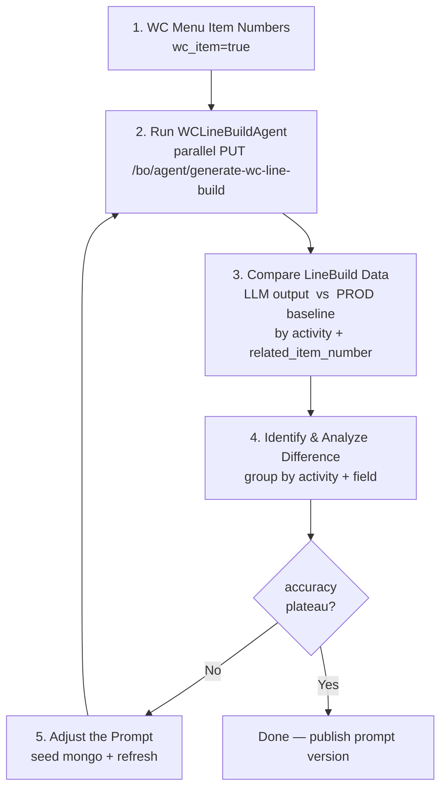

# WC Line Build Agent Prompt Tuner

End-to-end loop: **read prod baseline → call local API → compare → adjust prompt → reseed → re-run** until LLM output matches prod line build config.

## Hard rules (read first)

1. **prod (`mongodb-prod_*`) is READ-ONLY**. Never call any prod write tool (`insert/update/delete/aggregate-with-out`). All writes go to `mongodb-local_*` only.
2. **Local agent collections live in `mongodb-local` db = `recipe-agent`**; prod menu data lives in `mongodb-prod` db = `recipe-v2`.
3. **Each HTTP request needs a unique `chat_session_id`** (use `uuid.uuid4().hex[:12]` per call). Reusing one ID makes ADK reuse session memory → wrong test.
4. **The three target brands**: `Royal Greens` / `Limesalt` / `Yasas by Michael Symon`. Only menu items whose `brand_names` intersect with these are valid inputs.
5. **Prompt `_id`** in `recipe-agent.agent_instruction_configs` is `7b4f1c9a-1d8e-4f2a-9c3b-5e6f7a8b9c0d` (`instruction_name = LINE_BUILD_FILLER`).
6. Refresh after each prompt update: `curl -sk -X PUT https://127.0.0.1:5097/bo/agent/refresh`. If service has prompt cache issues, ask user to restart instead.

## Trust-source-first mindset (核心原则)

**Prod is the source of truth.** Whenever LLM output differs from prod's line-build configuration, **do NOT immediately patch the prompt to make the LLM "win" the comparison**. Instead:

1. **Re-think prod's underlying rule** — why is prod configured the way it is? What business / kitchen-operation reason explains this value? (e.g. "Limesalt salad parking is AMBIENT because salads are cold-served"; "Quesadilla uses TURBO_OVEN not PRESS because the dish needs the cheese melted, not pressed flat".)
2. **Form a hypothesis** about the rule (per-brand default? per-dish-type override? menu-name keyword trigger? a specific itemNumber's appliance preference?).
3. **Verify the hypothesis by querying prod data rigorously** — use `mongodb-prod_aggregate` to slice `item_versions` by brand / dish-category / itemNumber / activity and confirm the pattern statistically (e.g. "92% of Limesalt salads use `(15, 1800, AMBIENT)`; the remaining 8% are all `Quesadilla`"). Quote sample sizes.
4. **Only then encode the verified rule in the prompt.** Add a comment in the prompt explaining the prod-side evidence (e.g. "Limesalt Quesadilla family → `(1200, WARM)` — confirmed across 8/9 prod menus") so future maintainers can re-verify.
5. **Stay honest about the limits**: when a difference is genuine prod variance (different chefs, A/B test, restaurant-specific) or a known skeleton issue (wrong `related_item_number`), say so explicitly and **don't bend the prompt to chase noise**.

This discipline keeps the prompt aligned with reality, prevents over-fitting to the test set, and makes every rule traceable back to prod evidence.

## Standard loop (one iteration)



Per-step notes:

1. **WC Menu Item Numbers** — query `recipe-agent.item_version_line_build_cook_methods` for `wc_item=true` menu numbers, then map to effective `item_version_id` via prod `recipe-v2.item_versions`.

   **Test-set filtering (recommended)**: prefer menus whose **`item_customization` is null or empty** (`item_customization == null` OR `item_customization.options` array is empty). BYO / customizable dishes (e.g. `Bowl (BYO), Limesalt`) carry multiple line_build variants per restaurant / option and their COMPLETE/COOK configs drift across variants — they are the dominant source of statistical noise in the comparison phase. Filtering them out shrinks the test set (e.g. 68 → 31 menus) and gives a cleaner per-field accuracy signal on the canonical line build.

   When iterating on RULE 2 (`hold_usage_seconds` / `parking_spot`) or RULE 3 (COOK tuple selection), the no-customization subset is the right test set; only after those rules plateau should you re-add BYO menus to validate that the prompt doesn't regress on the complex shapes.

   Example aggregation (prod read-only):
   ```
   db.item_versions.aggregate([
     { $match: { _id: { $in: [...effective ivids...] } } },
     { $project: {
         name: 1, item_number: 1,
         has_customization: {
           $cond: [
             { $or: [
                 { $eq: ["$item_customization", null] },
                 { $eq: [ { $ifNull: ["$item_customization.options", []] }, [] ] }
             ] },
             false, true
           ]
         }
     } },
     { $match: { has_customization: false } }
   ])
   ```

2. **Run WCLineBuildAgent** — `scripts/runner_parallel.py` fires concurrent requests (unique `chat_session_id` per call), polls `generate_wc_line_build_logs` for completion, dumps to `llm-output.json`.
3. **Compare** — `scripts/excel_report.py` matches LLM procedures to prod procedures by overlapping `related_item_number` within each activity bucket; unmatched LLM procedures are excluded from accuracy stats and listed separately.
4. **Identify & Analyze** — open `report.xlsx` → `Mismatches` / `LLM-Unmatched` sheets; group by `(activity, field)`; classify as prompt issue / skeleton issue / prod outlier.
5. **Adjust the Prompt** — edit `openspec/wc-line-build-agent-prompt-v4-draft.md`; `scripts/seed_prompt.py` writes it back to mongo and `curl PUT /bo/agent/refresh` reloads the agent.

Salad-heavy traffic: this endpoint's live requests are dominated by salad menus. Always sanity-check `BYO Greens Bowl, Royal Greens` + `Salad (BYO), Limesalt` + Yasas spreads before declaring a prompt version stable.

## Quick Usage

All scripts read/write a single output directory. By default that's `./prompt-tuner-out/`
relative to wherever you run python from; override with the `PROMPT_TUNER_OUT_DIR`
environment variable for any other layout.

```bash
# Pick your output directory (one-time, optional)
export PROMPT_TUNER_OUT_DIR=/path/to/your/workspace/tuner-out
```

The skill assumes the agent service is running locally at
`https://127.0.0.1:5097` with MongoDB at `mongodb://localhost:27017`. Adjust the
constants at the top of each script if your setup differs.

### Pull baseline

```bash
# 1. Pull the wc_item=true menu list from your local mongo (one-off setup helper):
python -c "from pymongo import MongoClient; \
  c = MongoClient('mongodb://localhost:27017')['recipe-agent']['item_version_line_build_cook_methods']; \
  ids = sorted({m['menu_item_number'] for r in c.find({}) for m in r['methods'] if m.get('wc_item')}); \
  import json, os; \
  os.makedirs(os.environ.get('PROMPT_TUNER_OUT_DIR', 'prompt-tuner-out'), exist_ok=True); \
  open(os.path.join(os.environ.get('PROMPT_TUNER_OUT_DIR', 'prompt-tuner-out'), 'wc_item_numbers.json'), 'w').write(json.dumps(ids))"

# 2. Use mongo-prod MCP tool (or pull_baseline.py with --prod-uri) to resolve those
#    item_numbers to current effective item_version_ids, save as <out>/ivids.json
#    (a JSON list of strings — one item_version_id per element).

# 3. Pull the baseline from prod (read-only):
python scripts/pull_baseline.py --ivids "$PROMPT_TUNER_OUT_DIR/ivids.json" --prod-uri "$PROD_MONGO_URI"
# Produces: <out>/baseline-raw.json + <out>/baseline.json
```

### Seed prompt md → mongo + refresh

```bash
python scripts/seed_prompt.py --prompt path/to/your-prompt.md
curl -sk -X PUT https://127.0.0.1:5097/bo/agent/refresh
```

### Parallel run + compare

```bash
rm -f "$PROMPT_TUNER_OUT_DIR/llm-output.json"
python scripts/runner_parallel.py --workers 8
python scripts/compare.py
```

### Inspect a single item

```bash
python scripts/show_item.py --name "Salad (BYO), Limesalt"
```

## Common Gotchas

- **HTTP method is `PUT` not POST** on `/bo/agent/generate-wc-line-build`. Returns 204 + async kafka.
- **Endpoint is async**: polling `generate_wc_line_build_logs.{succeed_time|fail_time}` is the only way to know when done. Default poll = 3s, timeout = 300s.
- **brand_names mismatch ≠ multi-brand bug**: a menu item routinely belongs to 5+ brands; the rule is first-match in priority order (`Limesalt > Yasas > Royal Greens`). Salad menus override to Royal Greens by default.
- **Placeholder COOK procedures** (where `related_item_number = null`) cannot be inferred from cook_methods samples — LLM will guess wrong (e.g. Quesadilla family). Either add a hardcoded fallback to the prompt or change the skeleton builder.
- **Schema constraint**: Gemini's controlled generation rejects `anyOf` siblings — see `LineBuildFillResultSchema.procedureSchema()`. Don't add `type`/`description` next to `anyOf`.
- **`cook_methods` regeneration**: if you change `TARGET_ACTIVITIES` / `HDR_OBJECT_TYPES` in `InitItemVersionLineBuildCookMethodController`, restart the service and call `PUT /_app/agent/item-version-line-build-cook-method/init` before running the loop.
- **`wc_item=true` filter**: the init script tags a method with `wc_item=true` iff its brand_names intersects with `["Royal Greens", "Limesalt", "Yasas by Michael Symon"]`. Pre-filter your test set with this flag.

## Output directory layout

Everything the scripts read/write lives under one directory (default `./prompt-tuner-out/`,
override via `PROMPT_TUNER_OUT_DIR`):

| File | Producer | Purpose |
|---|---|---|
| `ivids.json` | user / one-off helper | JSON list of `item_version_id` to test |
| `baseline-raw.json` | `pull_baseline.py` | Full prod `item_versions` documents (for skeleton checks) |
| `baseline.json` | `pull_baseline.py` | Compact view used by runner + compare |
| `llm-output.json` | `runner_parallel.py` | Per-item LLM response + skeleton + log metadata |
| `mismatches.json` | `compare.py` | Per-field mismatch dump |

Backend code locations the scripts reference (paths inside the consuming repo):

| Relative path | Purpose |
|---|---|
| `backend/master-data-agent-service/src/main/java/app/agent/builder/WCLineBuildBuilder.java` | Skeleton generation (COOK / GARNISH / COMPLETE) |
| `backend/master-data-agent-service/src/main/java/app/agent/service/WCLineBuildCookMethodResolver.java` | Loads cook_methods hits + appliance catalog |
| `backend/master-data-agent-service/src/main/java/app/agent/web/controller/InitItemVersionLineBuildCookMethodController.java` | Builds `item_version_line_build_cook_methods` from prod menu items |
| `backend/master-data-agent-service/src/main/java/app/agent/agent/schema/LineBuildFillResultSchema.java` | Gemini response schema (anyOf per activity) |

## First-Time Setup (If Not Configured)

1. Ensure local service is running on `https://127.0.0.1:5097` with mongo on `mongodb://localhost:27017`.
2. Confirm `recipe-agent.agent_instruction_configs` has the LINE_BUILD_FILLER document (`_id = 7b4f1c9a-...`).
3. Confirm `recipe-agent.item_version_line_build_cook_methods` is populated. If empty, call `PUT /_app/agent/item-version-line-build-cook-method/init`.
4. `pip install --user pymongo` (the only Python dep; uses stdlib `urllib` + `ssl` for HTTP).
5. Set prod mongo MCP credentials in agent config (read-only).
